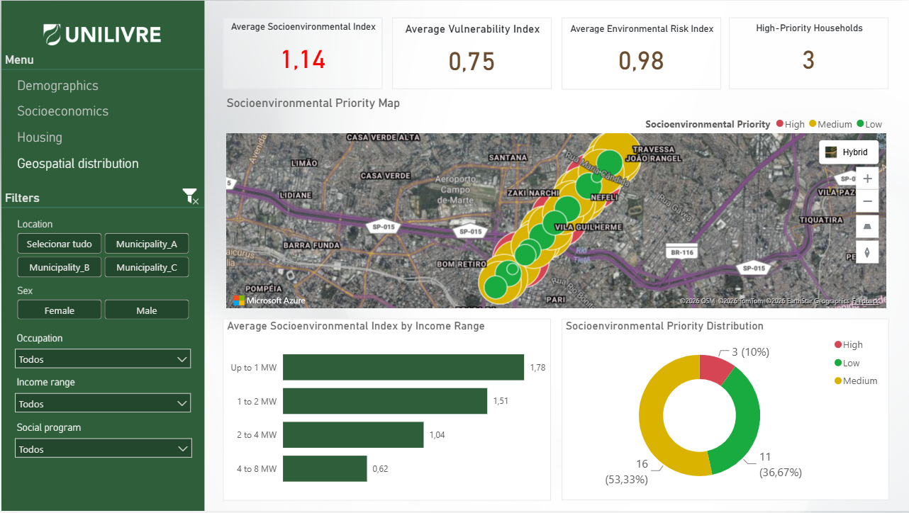
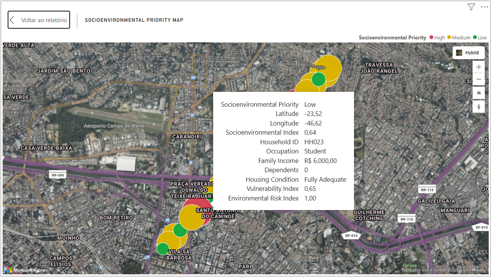
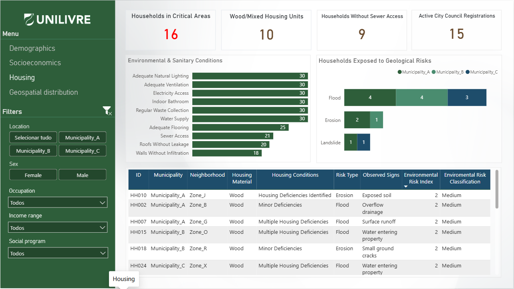

# 🌎 Territorial Risk Intelligence


An end-to-end data analytics project designed to transform household survey data into actionable territorial intelligence products.

This project demonstrates the complete lifecycle of a territorial risk assessment initiative, from survey design and data preparation to analytical modeling, geospatial analysis, and interactive business intelligence dashboards.

---

# 🎯 Project Overview

Territorial vulnerabilities are influenced by a combination of social, environmental, housing, and geographic factors.

This project integrates these dimensions into a unified analytical framework capable of:

- Identifying vulnerable households
- Assessing environmental risks
- Prioritizing intervention areas
- Supporting territorial planning
- Enabling evidence-based decision-making

The solution combines Data Engineering, Analytics, Geospatial Intelligence, and Business Intelligence techniques to provide a holistic view of socioenvironmental risk.

---

# 📸 Dashboard Highlights

## 🌍 Geospatial Distribution

Interactive territorial intelligence dashboard integrating social vulnerability, environmental risk, housing conditions, and spatial analysis.


---

## 🔎 Household-Level Geospatial Analysis

Interactive tooltip providing detailed household-level intelligence, including socioeconomic characteristics, housing conditions, and integrated risk indicators.



---

## 🏠 Housing Conditions & Environmental Assessment

Infrastructure, environmental risk exposure, housing conditions, and sanitary indicators.



---

# 📝 Survey Design

A key component of this project was the design and structuring of the household survey instrument used to collect territorial data.

The survey was planned to capture demographic, socioeconomic, housing, environmental, and geospatial information at the household level.

### Survey Dimensions

- Demographics
- Education
- Occupation
- Household composition
- Income profile
- Social program participation
- Housing conditions
- Environmental risks
- Territorial location
- Geospatial references

### Survey Design Activities

- Questionnaire structure definition
- Variable standardization
- Response categorization
- Data collection planning
- Geospatial requirements definition
- Analytical indicator requirements

The resulting dataset was specifically designed to support risk assessment, territorial prioritization, and geospatial analysis.

---

# 🏗️ Project Architecture

```text
Survey Design
        ↓
Field Data Collection
        ↓
Raw Survey Data
        ↓
Data Preparation
        ↓
Data Normalization
        ↓
Relational Data Model
        ↓
Social Vulnerability Assessment
        ↓
Environmental Risk Assessment
        ↓
Integrated Socioenvironmental Matrix
        ↓
Geospatial Analysis
        ↓
Power BI Dashboard
        ↓
Territorial Risk Intelligence
```

Architecture diagrams and technical documentation are available in:

```text
architecture/
```

---

# 📂 Repository Structure

```text
territorial-risk-intelligence/
│
├── architecture/
├── analytics/
├── data/
├── docs/
├── notebooks/
├── power_bi/
│
├── README.md
└── requirements.txt
```

---

# 🗃️ Data Model

The project is based on a normalized household survey model.

### Core Entities

```text
Households
    │
    ├── Social Programs
    │
    ├── Housing Conditions
    │
    ├── Environmental Risks
    │
    └── Locations
```

### Analytical Outputs

```text
Households Vulnerability
Households Environmental Risk
Socioenvironmental Matrix
```

---

# 🧹 Data Engineering Workflow

The data engineering layer includes:

- Survey data ingestion
- Data cleaning
- Header standardization
- Feature engineering
- Household ID generation
- Income classification
- Geospatial preparation
- Data normalization
- Relational modeling

Implemented through Jupyter notebooks available in:

```text
notebooks/
```

---

# 📒 Notebooks

### 01_data_preparation.ipynb

- Raw data ingestion
- Data cleaning
- Standardization
- Feature engineering

### 02_social_programs_normalization.ipynb

- Social program normalization
- Indicator structuring
- Data modeling

### 03_housing_conditions_normalization.ipynb

- Housing condition normalization
- Infrastructure indicators
- Housing quality assessment

### 04_environmental_risks_normalization.ipynb

- Environmental risk normalization
- Risk classification
- Analytical preparation

---

# 🧠 Analytics Layer

Located in:

```text
analytics/
```

The analytics layer transforms processed datasets into territorial intelligence products.

---

## 📈 Social Vulnerability Assessment

```text
vulnerability_index.py
```

Calculates household vulnerability based on:

- Age group
- Family income
- Dependents
- Housing tenure
- Social program participation

Output:

```text
households_vulnerability_sample.csv
```

---

## 🌧️ Environmental Risk Assessment

```text
environmental_risk_index.py
```

Calculates environmental risk based on:

- Housing material
- Environmental hazards
- Risk indicators
- Registration status

Output:

```text
households_environmental_risk_sample.csv
```

---

## 🌱 Integrated Socioenvironmental Matrix

```text
socioenvironmental_matrix.py
```

Integrates:

- Social Vulnerability Index
- Environmental Risk Index

Outputs:

- Socioenvironmental Index
- Priority Classification
- Household Ranking

Output:

```text
socioenvironmental_matrix_sample.csv
```

Priority Levels:

```text
Low
Medium
High
Critical
```

---

# 🌍 Geospatial Intelligence

Geospatial analysis is a core component of the project.

The solution combines:

- Household locations
- Watershed segmentation
- Housing conditions
- Environmental risk indicators
- Social vulnerability indicators

to support territorial prioritization.

### Capabilities

- Household-level mapping
- Risk hotspot detection
- Watershed analysis
- Spatial prioritization
- Territorial decision support

> Geographic coordinates available in this repository are synthetic values generated exclusively for demonstration purposes.

---

# 📊 Power BI Dashboard

The Power BI solution consolidates demographic, socioeconomic, environmental, housing, and geospatial indicators into an interactive territorial intelligence platform.

### 👥 Demographics

- Total Households
- Total Residents
- Female-Headed Households
- Households with Dependents
- Education Profile
- Occupation Profile

### 💰 Socioeconomics

- Income Distribution
- Average Family Income
- Average Per Capita Income
- Social Program Participation
- Beneficiary Households

### 🏠 Housing

- Housing Conditions
- Geological Risk Exposure
- Environmental & Sanitary Conditions
- Critical Areas
- Housing Quality Indicators

### 🌎 Geospatial Distribution

- Socioenvironmental Priority Map
- Household-Level Analysis
- Priority Distribution
- Spatial Risk Assessment
- Income vs Priority Analysis

Detailed dashboard documentation is available in:

```text
power_bi/
```

---

# 🛠️ Technologies

### Data Engineering

- Python
- Pandas
- Jupyter Notebook

### Analytics

- Python
- Risk Scoring Models
- Feature Engineering

### Business Intelligence

- Power BI
- DAX
- Power Query

### Geospatial Analysis

- Azure Maps
- Spatial Visualization
- Territorial Intelligence

---

# 🔐 Data Privacy

All datasets included in this repository are anonymized and synthetic.

The repository does not contain:

- Real household information
- Real addresses
- Real geographic coordinates
- Personally identifiable information

The published datasets were created exclusively for demonstration, educational, and portfolio purposes.

---

# 🚀 Key Skills Demonstrated

- Survey Design
- Questionnaire Development
- Data Collection Planning
- Data Engineering
- Data Cleaning
- Feature Engineering
- Data Normalization
- Relational Modeling
- Analytics Engineering
- Risk Assessment
- Geospatial Analysis
- Territorial Intelligence
- Business Intelligence
- Dashboard Development
- Power BI
- Azure Maps

---

# 📬 Contact

If you would like to discuss the project, exchange ideas, or collaborate, feel free to connect through GitHub or LinkedIn.

---

⭐ If you found this project interesting, consider giving the repository a star.
